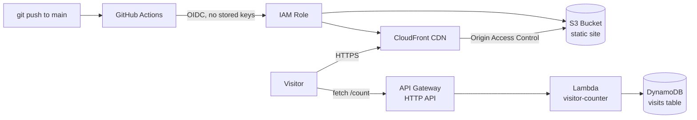

# Cloud Resume Challenge

My take on the [Cloud Resume Challenge](https://cloudresumechallenge.dev/): a personal portfolio site built as a hands-on way to prove real, working knowledge of AWS, infrastructure as code, and CI/CD, coming from a manufacturing engineering background.

**Live site:** https://d13kh6u2v9d41x.cloudfront.net

## Architecture



The site itself is plain HTML, CSS, and JavaScript, no framework, no build step. That was a deliberate choice: the goal of this project is proving AWS and DevOps competency, not framework knowledge, so keeping the front end as simple as possible keeps the focus on the infrastructure around it.

The animated background is a Three.js particle scene loaded from a CDN, so there is still no build step: the files in this repo are exactly the files in the S3 bucket.

## What this project demonstrates

- **Static hosting on AWS**: S3 bucket kept fully private (Block Public Access on), served through CloudFront with Origin Access Control, HTTPS by default.
- **Serverless visitor counter**: browser calls an API Gateway HTTP API, which triggers a Lambda function, which does an atomic increment on a DynamoDB table. No server to manage.
- **Least-privilege IAM**: every role and policy in this project grants only the specific actions on the specific resources needed, nothing broader.
- **Infrastructure as Code**: the entire stack (S3, CloudFront, DynamoDB, Lambda, API Gateway, IAM) is written in Terraform under [`infra/`](infra/), documenting the architecture as code even where resources were provisioned manually first.
- **Automated testing**: the Lambda function has unit tests ([`backend/test_lambda_function.py`](backend/test_lambda_function.py)) that mock AWS calls, no live credentials needed to run them.
- **CI/CD with no stored credentials**: pushing to `main` triggers a GitHub Actions workflow ([`.github/workflows/deploy.yml`](.github/workflows/deploy.yml)) that deploys automatically. Authentication to AWS uses OIDC federation instead of long-lived access keys, GitHub proves its identity directly to AWS for each run, and no AWS secret ever exists in GitHub.

## How the front end was built

The page's 3D scene and motion were built with [Claude Code](https://claude.com/claude-code), using Claude skills for Three.js and UI animation. One set of particles morphs as you scroll: a globe with all 34 AWS Regions (drag it to spin it), a galaxy, and a flowchart of my three AWS projects, with light pulses running along the connections. I set the design direction, reviewed each version, and kept it light enough to hold 60 fps on integrated graphics.

The site also has a local-only edit mode (`edit.js`): open it on `localhost` with `?edit`, click any text to change it, and save straight back into `index.html`. It is never deployed.

## Two debugging stories worth telling

**The typo that taught me DynamoDB tables can't be renamed.** Early on, I misspelled "portfolio" as "portifolio" when naming the S3 bucket, and later the DynamoDB table too. When wiring up the Lambda function, I assumed the code was right and the IAM policy was wrong, so I "fixed" the policy to match the correctly-spelled code. That produced a new, different error (`ResourceNotFoundException`) that revealed the real table name had the typo all along, and DynamoDB tables can't be renamed after creation. The actual fix was updating the Lambda code and IAM policy to match the real (typo'd) table name, and leaving the data layer alone. Small bug, good lesson in checking assumptions against the real resource instead of the code.

**The OIDC trust policy that "looked" correct but wasn't.** Setting up GitHub Actions to deploy via OIDC (see architecture above), the AWS role's trust policy was configured to trust `repo:OWNER/REPO`, following the standard format, and every AWS support doc. Every deploy attempt still failed with a generic `AccessDenied`, even though the audience, the identity provider, and the repo name all matched. Checking CloudTrail's event history (instead of guessing) showed the actual identity token GitHub sends now includes immutable numeric IDs alongside the repo and owner name (`repo:OWNER@123456/REPO@789012:ref:...`), a security change GitHub rolled out to stop renamed or transferred repos from inheriting old trust relationships. The trust policy needed those IDs, not just the names, to match.

## Tech stack

`HTML` `CSS` `JavaScript` `Three.js` &middot; `S3` `CloudFront` `Lambda` `API Gateway` `DynamoDB` `IAM (OIDC)` &middot; `Terraform` &middot; `GitHub Actions` &middot; `Python` `unittest` &middot; `Claude Code`

## Repository structure

```
index.html, styles.css, script.js   the site itself
universe.js                         Three.js particle scene
edit.js                             local-only edit mode (not deployed)
backend/                            Lambda function + unit tests
infra/                              Terraform (infrastructure as code)
.github/workflows/deploy.yml        CI/CD pipeline
```

## About me

I'm Gabriel Luz, a Computer Science & Engineering student at the University of Toledo, moving into cloud and DevOps after several years in manufacturing engineering. This project is part of that transition, built to prove hands-on AWS ability rather than just claim it.
